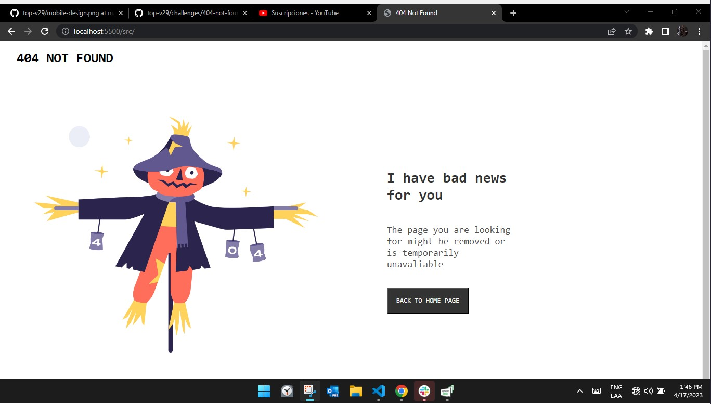
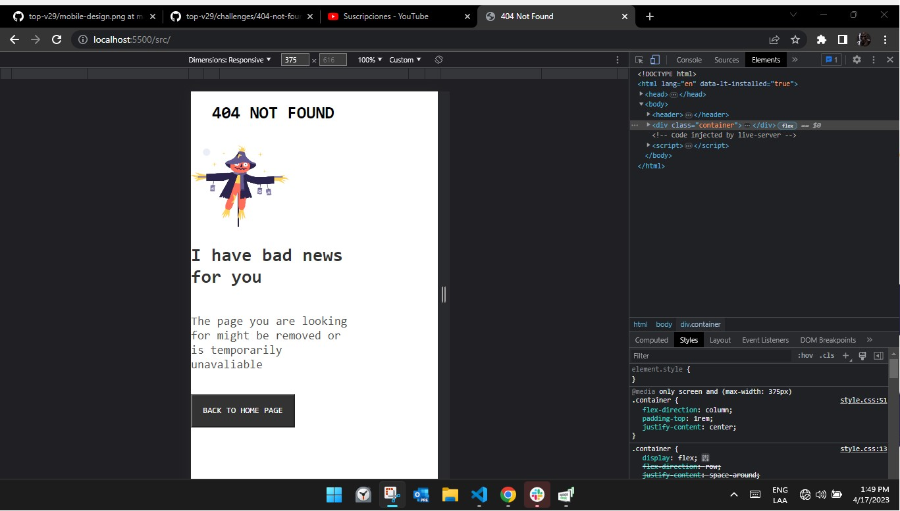

# Make It Real -  404 Not Found Page

This is a solution to the  404 Not Found Page project of the Make It Real course.

## Table of contents

- [Make It Real -  404 Not Found Page](#make-it-real----404-not-found-page)
  - [Table of contents](#table-of-contents)
  - [Overview](#overview)
    - [The challenge](#the-challenge)
    - [Screenshot](#screenshot)
  - [My process](#my-process)
    - [Built with](#built-with)
    - [What I learned](#what-i-learned)
    - [Continued development](#continued-development)
    - [Useful resources](#useful-resources)
  - [Author](#author)
  - [Acknowledgments](#acknowledgments)


## Overview

### The challenge

Users should be able to:

- Ver el diseño óptimo según el tamaño de pantalla de su dispositivo


### Screenshot




## My process

### Built with

- Semantic HTML5 markup
- CSS Variables
- Flexbox
- Mobile-first workflow
- Media Queries

### What I learned

```html
<h1>Some HTML code I'm proud of</h1>
<ol>
<li>Semantic HTML5 markup</li>
<li>CSS Variables</li>
<li> Flexbox</li>
<li>Mobile-first workflow</li>
<li>Media Queries</li>
</ol>
```
### Continued development

image resizing, CSS Pseudo Selectors

### Useful resources

- [Resource 1](https://developer.mozilla.org/es/docs/Web/CSS/Media_Queries/Using_media_queries) - This helped me with creating media queries
- [Resource 2](https://developer.mozilla.org/es/docs/Web/CSS/--*) - This is an amazing article which helped me finally understand CSS variables. I'd recommend it to anyone still learning this concept.

## Author

- Github - [Michael](https://github.com/Mike2020x)


## Acknowledgments
